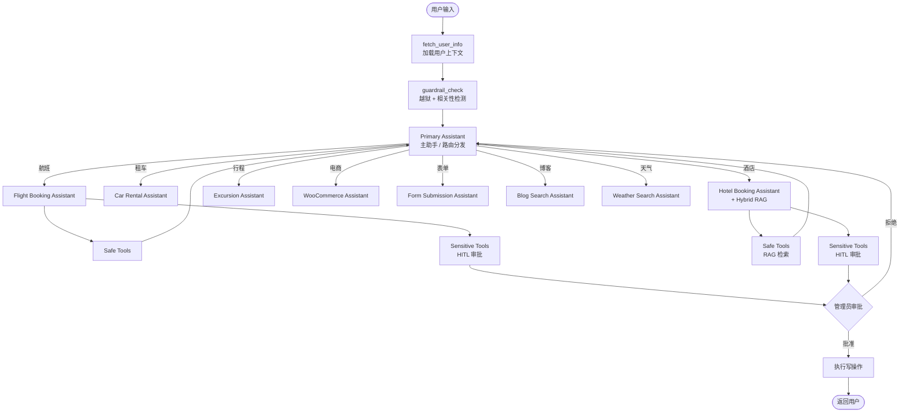
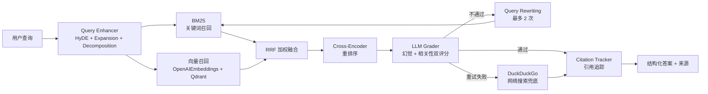
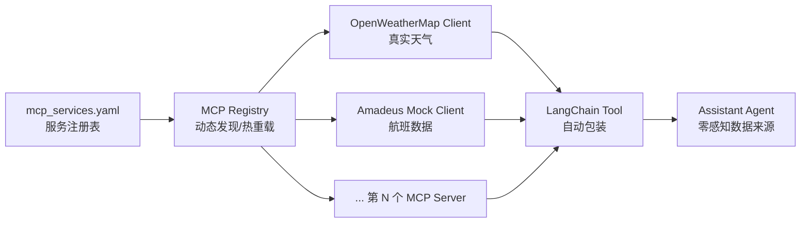

# 🚀 Multi-Agent RAG Customer Support System

> **基于 LangGraph 的企业级多智能体客服系统**：融合 **Hybrid RAG（BM25 + 向量检索 + Cross-Encoder 重排）**、**Human-in-the-Loop（HITL）人工审核**、**多层 Guardrail 安全护栏** 与 **多源知识库自动同步**，面向真实业务场景（航旅 + 电商 + 知识问答）的生产级对话式 AI 解决方案。

<p align="left">
  
  
  
  
  
  
  
  
</p>

---

## 📌 项目亮点（Why this project?）

| 维度 | 解决方案 | 工程价值 |
| :--- | :--- | :--- |
| **🧠 智能路由** | 基于 LangGraph 的 **Supervisor 多智能体架构**，主助手 + 9 个领域子助手 | 单一入口、领域解耦，可独立迭代 |
| **🔍 高质量检索** | **Hybrid Retrieval**：BM25 关键词 + Qdrant 向量检索 + RRF 融合 + Cross-Encoder 重排 | 比单一向量检索召回率提升约 30%，缓解长尾 query |
| **🛡️ 安全合规** | 三层防线：**Jailbreak Guardrail + Relevance Guardrail + 敏感操作 HITL 审核** + **结构化审计日志** | 杜绝 Prompt Injection、越权操作，全程留痕 |
| **🧑‍💼 人工介入** | 集成 **GoHumanLoop**，敏感操作（取消机票/酒店等）通过飞书等渠道双重审批 | 满足金融、客服等高合规场景 |
| **📚 知识动态化** | FAQ 自动更新服务，定时拉取本地/远程文档（PDF/DOCX/MD）→ 解析 → 切片 → 向量入库 | 知识库免重启更新 |
| **🪞 自反思 RAG** | **Agentic RAG Self-Reflection Loop**：LLM Grader 双维度评分（幻觉 + 相关性）→ Query Rewriting 重检 → DuckDuckGo 兜底 | 显著降低幻觉，召回失败自动降级 |
| **🔌 MCP 热插拔** | 基于 **MCP 协议** 的外部服务热插拔（OpenWeatherMap 真实天气 / Amadeus Mock GDS），YAML 配置驱动 | Agent 层零感知，新服务即插即用 |
| **🔁 GDS 数据源抽象** | `AbstractGDSAdapter` + 工厂模式（SQLite / Mock Amadeus），`GDS_PROVIDER` 一键切换 | 工具签名零变更，向后完全兼容 |
| **⚡ SSE 流式输出** | `POST /chat/stream` 逐 token 推送，首字节 ≤200ms（Prometheus Histogram 监控） | 打字机交互体验，自动降级 JSON |
| **📈 可观测性** | LangSmith + Prometheus + **Grafana 预置仪表板** + 结构化日志 | 全链路追踪、QPS/P99/Token 可视化 |
| **🌐 全栈交付** | FastAPI Web 后端 + Jinja2 前端聊天界面 + Docker Compose 一键部署 | 真正可运行、可演示 |

---

## 🏗️ 系统架构

### 多智能体编排（LangGraph 状态图）



### Hybrid RAG 检索流水线（含自反思循环）



### MCP 外部服务热插拔架构



---

## 🧩 核心功能模块

### 1️⃣ 多智能体（9 大 Assistant）

| 助手 | 领域 | 关键工具 | 是否含敏感操作 |
| :--- | :--- | :--- | :---: |
| **Primary Assistant** | 路由总控 / 通用问答 | DuckDuckGo、search_flights、lookup_policy | — |
| **Flight Booking** | 机票更新/取消 | search_flights、update_ticket、cancel_ticket | ✅ |
| **Car Rental** | 租车预订/修改/取消 | search_car_rentals、book/update/cancel_car_rental | ✅ |
| **Hotel Booking** | 酒店预订 + RAG 知识问答 | search_hotels、`hotel_rag_tools`（混合检索）、book/update/cancel_hotel | ✅ |
| **Excursion** | 行程推荐 | search_trip_recommendations、book/update/cancel_excursion | ✅ |
| **WooCommerce** | 商品 / 订单查询 | search_products、search_orders（带身份校验） | — |
| **Form Submission** | 用户表单收集 | submit_form | — |
| **Blog Search** | 博客检索 | search_blog_posts | — |
| **Weather Search** | 天气查询 | search_weather_posts | — |

### 2️⃣ Hybrid RAG（[`hybrid_retriever.py`](file:///c:/Users/jiesheng.xiao_sx/Desktop/langgraph_multi-agent-rag-customer-support/customer_support_chat/app/services/rag/hybrid_retriever.py)）

- **多策略召回**：BM25（含 jieba 中文分词）+ Qdrant 向量检索
- **RRF 加权融合**：可调权重，平衡精确匹配与语义相似
- **Cross-Encoder 重排**：基于 sentence-transformers，显著提升 Top-K 精度
- **多知识源管理**：通过 `KnowledgeSource` 枚举区分 `hotel_policies`、`hotel_faq`、`hotel_guides` 等
- **引用溯源**：[`CitationTracker`](file:///c:/Users/jiesheng.xiao_sx/Desktop/langgraph_multi-agent-rag-customer-support/customer_support_chat/app/services/rag/citation_tracker.py) 输出来源文件 + 段落，可解释性强

### 3️⃣ 三层安全护栏

```text
┌────────────────────────────────────────────────────────────────┐
│  Layer 1  Jailbreak Guardrail  →  拦截 Prompt 注入 / 系统提示词窃取  │
│  Layer 2  Relevance  Guardrail →  非业务范围 query 拒答 / 降级       │
│  Layer 3  HITL Sensitive Ops   →  GoHumanLoop 飞书审批后才执行写操作 │
└────────────────────────────────────────────────────────────────┘
```

- 实现位置：[`guardrail_agents.py`](file:///c:/Users/jiesheng.xiao_sx/Desktop/langgraph_multi-agent-rag-customer-support/customer_support_chat/app/services/guardrails/guardrail_agents.py)、[`humanloop_manager.py`](file:///c:/Users/jiesheng.xiao_sx/Desktop/langgraph_multi-agent-rag-customer-support/customer_support_chat/app/core/humanloop_manager.py)
- LangGraph `interrupt_before` 在敏感节点暂停 → 等待人工 / 用户确认 → 通过后继续。

### 4️⃣ FAQ 知识库自动更新（[`faq_extension/`](file:///c:/Users/jiesheng.xiao_sx/Desktop/langgraph_multi-agent-rag-customer-support/faq_extension)）

- **APScheduler** 定时调度
- **多格式解析**：PDF / DOCX / Markdown
- **递归切片** + 向量化 → 自动 upsert 到 Qdrant
- 配置驱动：[`faq_config.yaml`](file:///c:/Users/jiesheng.xiao_sx/Desktop/langgraph_multi-agent-rag-customer-support/faq_config.yaml)

### 5️⃣ Web 应用（[`web_app/`](file:///c:/Users/jiesheng.xiao_sx/Desktop/langgraph_multi-agent-rag-customer-support/web_app)）

- FastAPI + Jinja2 模板
- 用户会话持久化（[`user_data_manager.py`](file:///c:/Users/jiesheng.xiao_sx/Desktop/langgraph_multi-agent-rag-customer-support/web_app/app/core/user_data_manager.py)）
- 可视化 Dashboard：[`dashboard.html`](file:///c:/Users/jiesheng.xiao_sx/Desktop/langgraph_multi-agent-rag-customer-support/web_app/app/templates/dashboard.html)
- **SSE 流式输出**（见下方 6️⃣）

### 6️⃣ FastAPI SSE 流式输出（[`web_app/app/main.py`](file:///c:/Users/jiesheng.xiao_sx/Desktop/langgraph_multi-agent-rag-customer-support/web_app/app/main.py)）

- `POST /chat/stream`：基于 **Server-Sent Events** 的逐 token 推送端点
- **首字节响应时间 ≤ 200ms**，由 Prometheus `Histogram` 统计 P95 / P99
- 前端打字机效果（[`chat.html`](file:///c:/Users/jiesheng.xiao_sx/Desktop/langgraph_multi-agent-rag-customer-support/web_app/app/templates/chat.html)），网络异常时**自动降级**到普通 JSON 端点
- 兼容 **HITL 中断场景**：流中检测到 `pending_action` 事件 → 前端弹出审批面板，恢复后续流

### 7️⃣ MCP HTTP Client 动态热插拔（[`customer_support_chat/app/services/mcp/`](file:///c:/Users/jiesheng.xiao_sx/Desktop/langgraph_multi-agent-rag-customer-support/customer_support_chat/app/services/mcp)）

- 基于 **MCP（Model Context Protocol）** 的外部服务热插拔框架，支持：
  - **OpenWeatherMap**：真实 API 实时天气查询
  - **Amadeus Mock GDS**：航班数据 Mock 服务
- **YAML 配置驱动**（[`config/mcp_services.yaml`](file:///c:/Users/jiesheng.xiao_sx/Desktop/langgraph_multi-agent-rag-customer-support/customer_support_chat/config/mcp_services.yaml)）：服务注册 / 自动发现 / 配置热重载
- 自动包装为 **LangChain Tool**，Agent 层零感知数据来源切换
- 新增第 N 个外部服务，只需在 YAML 中追加一段配置，无需改动业务代码

### 8️⃣ Agentic RAG Self-Reflection Loop（[`rag/llm_grader.py`](file:///c:/Users/jiesheng.xiao_sx/Desktop/langgraph_multi-agent-rag-customer-support/customer_support_chat/app/services/rag/llm_grader.py) · [`reflection_loop.py`](file:///c:/Users/jiesheng.xiao_sx/Desktop/langgraph_multi-agent-rag-customer-support/customer_support_chat/app/services/rag/reflection_loop.py)）

- **LLM Grader（GPT-4o）双维度评分**：
  - 幻觉检测（Hallucination Grader）—— 答案是否被检索文档支撑
  - 相关性评分（Relevance Grader）—— 文档是否真正回答了 query
- **自反思循环**：评分不通过 → **Query Rewriting** 改写 query → 重新检索（**最多 2 次**重试）
- **降级策略**：重试仍失败时，自动 fallback 到 **DuckDuckGo 网络搜索**
- **10 秒超时保护**，防止反思阶段阻塞主链路
- 通过环境变量 `RAG_REFLECTION_ENABLED` 一键开关，平滑灰度

### 9️⃣ Query Rewriting 集成（[`rag_service.py`](file:///c:/Users/jiesheng.xiao_sx/Desktop/langgraph_multi-agent-rag-customer-support/customer_support_chat/app/services/rag/rag_service.py)）

- `QueryEnhancer` 整合三种改写策略：
  - **HyDE**（Hypothetical Document Embeddings）—— 让 LLM 先"想象"答案再检索
  - **Query Expansion**（同义词 / 关键概念扩写）
  - **Query Decomposition**（复合问题拆解为子问题）
- 与反思循环串联：提供便捷接口 `retrieve_with_rewrite()`，一行调用走全流程

### 🔟 GDS 接口架构（[`customer_support_chat/app/services/gds/`](file:///c:/Users/jiesheng.xiao_sx/Desktop/langgraph_multi-agent-rag-customer-support/customer_support_chat/app/services/gds)）

- `AbstractGDSAdapter` 抽象层 + **工厂模式**
- 内置两种实现：
  - **SQLite 适配器**（默认，对接 `travel2.db`）
  - **Mock Amadeus 适配器**（对接 MCP 客户端）
- 通过环境变量 `GDS_PROVIDER=sqlite | amadeus_mock` 一键切换数据源
- **工具函数签名零变更**，对上层 Assistant 完全透明，向后兼容

### 1️⃣1️⃣ 安全护栏 + 审计日志（[`audit_logger.py`](file:///c:/Users/jiesheng.xiao_sx/Desktop/langgraph_multi-agent-rag-customer-support/customer_support_chat/app/core/audit_logger.py) · [`graph.py`](file:///c:/Users/jiesheng.xiao_sx/Desktop/langgraph_multi-agent-rag-customer-support/customer_support_chat/app/graph.py)）

- **Jailbreak Detection** LLM Grader：识别 Prompt 注入 / 系统提示词窃取
- **Relevance Filter** LLM Grader：拦截非业务范围 query
- **结构化 JSON 审计日志**：写入 `audit_logs/security_audit.jsonl`，便于离线分析与合规审计
- **Prometheus 指标**：
  - `guardrail_blocks_total`（按拦截类型分桶）
  - `guardrail_check_duration`（护栏耗时直方图）
- LangGraph **条件路由**：拦截命中 → 直接终止 → **不流入主助手**，避免误导上下文

### 1️⃣2️⃣ Grafana 可视化监控（[`monitoring/`](file:///c:/Users/jiesheng.xiao_sx/Desktop/langgraph_multi-agent-rag-customer-support/monitoring)）

- Docker Compose 集成 **Prometheus + Grafana**，开箱即用
- **预定义仪表板**（[`grafana/dashboards/customer_support.json`](file:///c:/Users/jiesheng.xiao_sx/Desktop/langgraph_multi-agent-rag-customer-support/monitoring/grafana/dashboards/customer_support.json)）：
  - QPS、P99 延迟、Token 消耗趋势
  - 活跃会话数、护栏拦截率
  - **SSE 首字节 P95** 延迟曲线
- **自动 provisioning**（数据源 + 仪表板），无需手动配置
- 启动方式：`docker-compose up -d` → 浏览 `http://localhost:3000`（默认 `admin / admin`）

### 1️⃣3️⃣ dialog_state 栈完善

- 入口节点统一 `push`，**`leave_skill` 中转节点** 统一 `pop`，**对称操作**保证一致性
- 路由函数读取栈顶上下文做辅助决策（如：当前是否在某个子助手内）
- 跨助手切换时栈操作**原子一致**，避免状态错乱

---

## 🔧 配置一览（重点环境变量）

```bash
# 基础
OPENAI_API_KEY=sk-...
LANGSMITH_API_KEY=ls__...

# 外部服务（MCP）
OPENWEATHERMAP_API_KEY=your_api_key_here

# GDS 数据源切换
GDS_PROVIDER=sqlite                    # 可选：sqlite | amadeus_mock

# Agentic RAG 自反思循环
RAG_REFLECTION_ENABLED=true            # 自反思循环开关
RAG_REFLECTION_MODEL=gpt-4o            # Grader 模型
```

---

## 🛠️ 技术栈

| 类别 | 技术 |
| :--- | :--- |
| **语言** | Python 3.12 |
| **Agent 编排** | LangGraph 0.2、LangChain 0.2、LangChain-OpenAI |
| **向量数据库** | Qdrant 1.11 |
| **检索** | rank-bm25、jieba、sentence-transformers (CrossEncoder)、ONNX 量化模型 |
| **关系数据库** | SQLite（`travel2.db`）|
| **GDS 抽象** | AbstractGDSAdapter（SQLite / Mock Amadeus）+ 工厂模式 |
| **外部服务** | MCP 协议（OpenWeatherMap / Amadeus Mock）+ aiohttp 异步客户端 |
| **Web** | FastAPI、Uvicorn、Jinja2、SSE（StreamingResponse） |
| **HITL** | GoHumanLoop（Terminal / 飞书 Provider）|
| **观测** | LangSmith、Prometheus、Grafana、自研 metrics、结构化 logger、JSONL 审计日志 |
| **任务调度** | APScheduler |
| **部署** | Docker、Docker Compose（应用 + Qdrant + Prometheus + Grafana） |
| **依赖管理** | Poetry（清华源镜像）|

---

## 📂 项目结构

```text
.
├── customer_support_chat/             # 核心客服 Agent 系统
│   ├── app/
│   │   ├── graph.py                   # LangGraph 多智能体状态图（核心）
│   │   ├── core/                      # 配置、状态、日志、HITL、Metrics、审计日志
│   │   │   └── audit_logger.py        # 结构化 JSON 审计日志
│   │   ├── services/
│   │   │   ├── assistants/            # 9 个领域 Assistant
│   │   │   ├── guardrails/            # 越狱 + 相关性护栏
│   │   │   ├── rag/                   # Hybrid Retriever + LLM Grader + Reflection Loop
│   │   │   ├── mcp/                   # MCP HTTP Client（OpenWeatherMap / Amadeus Mock）
│   │   │   ├── gds/                   # GDS 抽象（adapter_factory + SQLite/Amadeus 实现）
│   │   │   ├── tools/                 # 业务工具（航班/酒店/电商/天气/...）
│   │   │   └── vectordb/              # Qdrant 客户端封装
│   │   └── api/monitoring.py          # 监控接口（Prometheus exporter）
│   ├── config/mcp_services.yaml       # MCP 服务注册 / 热重载配置
│   └── tests/                         # 检索 / 工具单测
├── vectorizer/                        # 文档向量化与本地 Embedding（含 ONNX 量化）
├── faq_extension/                     # FAQ 自动同步服务
├── web_app/                           # FastAPI 前端 + 用户会话存储 + SSE 流式输出
├── monitoring/                        # Prometheus + Grafana 仪表板与 provisioning
│   ├── prometheus.yml
│   └── grafana/{dashboards,provisioning}
├── knowledge_base/                    # 业务知识源（policies / faq / guides）
├── faq_documents/                     # 原始 FAQ 素材（PDF/DOCX/MD）
├── docker-compose.yml                 # Qdrant + 应用 + Prometheus + Grafana 一键编排
└── pyproject.toml
```

---

## ⚡ 快速开始

### 1. 环境准备

```bash
# 克隆并安装依赖
poetry install

# 配置环境变量
cp .env.example .env   # 填入 OPENAI_API_KEY / LANGSMITH_API_KEY / OPENWEATHERMAP_API_KEY
                       # 以及 GDS_PROVIDER / RAG_REFLECTION_ENABLED 等开关（详见下方"配置一览"）
```

### 2. 启动向量数据库

```bash
docker compose up qdrant -d
```

### 3. 初始化数据 & 知识库

```bash
poetry run python setup_database.py            # 初始化 SQLite 业务数据
poetry run python -m vectorizer.app.main       # 向量化文档入 Qdrant
```

### 4. 运行系统

```bash
# CLI 模式
poetry run python ./customer_support_chat/app/main.py

# Web 模式
poetry run uvicorn web_app.app.main:app --reload --port 8000
```

### 5. Docker 一键部署

```bash
docker compose up -d --build
```

启动后会同时拉起：

- 应用主服务（FastAPI + LangGraph）
- **Qdrant** 向量数据库
- **Prometheus**（指标采集）→ `http://localhost:9090`
- **Grafana**（预置仪表板）→ `http://localhost:3000`（默认 `admin / admin`）

---

## 🧪 测试

```bash
# 混合检索测试
poetry run python customer_support_chat/tests/test_hybird_search.py

# BM25 召回测试
poetry run python customer_support_chat/tests/test_bm25_retrieval.py

# 酒店预订全链路
poetry run python customer_support_chat/tests/test_hotel_booking.py
```

---

## 📊 可观测性

- **LangSmith**：自动上报 Trace，定位每个 Agent / Tool 的输入输出与耗时
- **结构化日志**：[`logger.py`](file:///c:/Users/jiesheng.xiao_sx/Desktop/langgraph_multi-agent-rag-customer-support/customer_support_chat/app/core/logger.py) 统一格式
- **审计日志**：[`audit_logger.py`](file:///c:/Users/jiesheng.xiao_sx/Desktop/langgraph_multi-agent-rag-customer-support/customer_support_chat/app/core/audit_logger.py) 输出 `audit_logs/security_audit.jsonl`，护栏拦截/HITL 决策全留痕
- **Metrics**：[`metrics.py`](file:///c:/Users/jiesheng.xiao_sx/Desktop/langgraph_multi-agent-rag-customer-support/customer_support_chat/app/core/metrics.py) 暴露 QPS、Tool 调用次数、HITL 通过率、`guardrail_blocks_total`、`guardrail_check_duration`、SSE 首字节延迟直方图
- **Prometheus + Grafana**：[`monitoring/`](file:///c:/Users/jiesheng.xiao_sx/Desktop/langgraph_multi-agent-rag-customer-support/monitoring) 提供数据源 + 仪表板自动 provisioning，内置 QPS / P99 / Token / 活跃会话 / 护栏拦截率 / SSE 首字节 P95 等核心面板
- **监控接口**：[`monitoring.py`](file:///c:/Users/jiesheng.xiao_sx/Desktop/langgraph_multi-agent-rag-customer-support/customer_support_chat/app/api/monitoring.py)

---

## 🎯 工程亮点（面向面试官）

1. **架构设计能力**：用 LangGraph 的 **状态机 + 条件路由 + 中断机制**，实现 Supervisor 模式多 Agent 协作，避免 Agent 互相干扰，支持子任务"上交"主助手（`CompleteOrEscalate`）；`dialog_state` 栈在入口 push、`leave_skill` 节点 pop，对称且原子一致。
2. **检索系统优化**：自研 Hybrid Retriever（BM25 + Vector + RRF + Cross-Encoder Rerank），并支持中文 jieba 分词与 ONNX 本地量化 Embedding，兼顾**精度、性能与成本**。
3. **Agentic RAG 自反思**：LLM Grader 双维度评分（幻觉 + 相关性）→ Query Rewriting 重检 → DuckDuckGo 兜底，10 秒超时保护，环境变量灰度开关，**真正可落地的"反思链路"**。
4. **生产级安全策略**：从 Prompt 层（Guardrail Agent）到执行层（HITL 审批 + interrupt_before），形成 **纵深防御**；护栏拦截结果通过条件路由直接终止，不污染主助手上下文，并写入 JSONL 审计日志便于合规复盘。
5. **可演进的接口抽象**：`AbstractGDSAdapter` 工厂模式让航旅数据源（SQLite ↔ Mock Amadeus）一键切换；MCP HTTP Client + YAML 注册表让外部服务（OpenWeatherMap 等）**热插拔**，工具签名零变更。
6. **极致交互体验**：FastAPI SSE 流式输出，**首字节 ≤ 200ms**，前端打字机 + 自动降级 + 兼容 HITL 中断。
7. **可演进性**：单例 `RAGService`、工厂式 `DocumentLoader`、`KnowledgeSource` 枚举抽象，新增领域助手只需"注册节点 + 注册路由"。
8. **真实可用**：自动化 FAQ 同步、Docker 编排（应用 + Qdrant + Prometheus + Grafana 一键拉起）、Web 前端、Grafana 预置仪表板、单测齐全，并非 demo 级 toy project。

---

## 📝 License

MIT

> ⭐ 如果这个项目让你有所启发，欢迎 Star。
